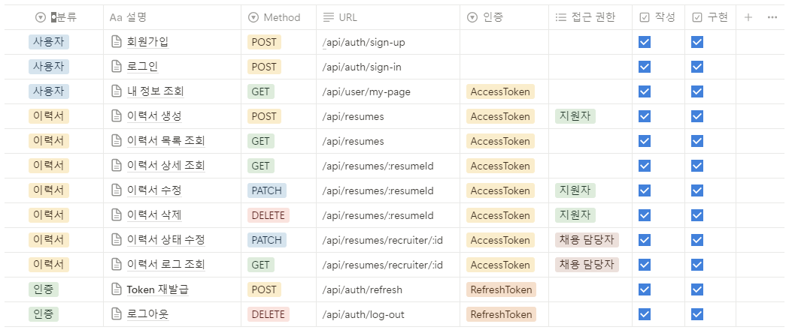

# 채용 서비스 백엔드 서버

## API 명세서

https://taropie313.notion.site/=Node-js-API-e3ec13d5f4944246a2cd1ec939c0afd2

## ERD

https://drawsql.app/teams/own-64/diagrams/spartanodejs04-resume

## 프로젝트 소개
express.js, mySQL을 이용하여 채용 서비스 백엔드 서버를 구현하여 이력서 작성, 조회, 수정, 삭제가 가능하도록 하였다.

### 서버 사용을 위한 사용자 정보 설명
#### 1) 채용 담당자
- email : admin@naver.com
- password : 000000

#### 2) 지원자 1
- email : aaaan@naver.com
- password : 000000

#### 3) 지원자 2
- email : bbbb@naver.com
- password : 000000

#### 4) 지원자 3
- email : cccc@naver.com
- password : 000000

#### 5) 지원자 4
- email : dddd@naver.com
- password : 000000

#### 6) 지원자 5
- email : eeee@naver.com
- password : 000000

## 코드 설명
회원가입과 로그인을 제외한 모든 기능은 로그인 된 사용자(AccessToken 보유)에 한해 접근 가능하다.
### 1. 미들웨어
- **auth.middleware.js** : AccessToken 인증 미들웨어로, 회원정보 조회, 이력서 작성, 조회, 수정, 삭제 등에 사용된다. 사용자의 id와 역할을 반환한다. 인증에 실패할 시 사용자의 토큰을 삭제한다.

- **error-handelr.middleware.js** : 에러 핸들러 미들웨어로, 예상하지 못한 에러가 발생했을 때 에러를 발생시키는 미들웨어이다.

- **role.middleware.js** : 역할 인가 미들웨어로, 이력서 상태 수정과 같이 역할이 ```RECRUITER```인 사용자만 접근 가능하거나, 혹은 이력서 작성과 같이 역할이 ```APPLICANT```인 사용자만 접근 가능한 기능을 구현할 때 사용된다. 사용자의 id를 반환한다.

- **token.middleware.js** : RefreshToken 인증 미들웨어로, AccessToken 재발급 및 로그아웃에 사용된다. 사용자의 id, 토큰, 만기일을 반환한다. 인증에 실패할 시 사용자의 토큰을 삭제한다.

### 2. 라우터
#### 1) users.router.js
- **post - /sign-up** : 이메일주소, 비밀번호, 비밀번호 확인, 이름을 전달받으면 사용자 정보가 등록되는 회원가입의 기능을 한다. 입력값이 조건에 맞을 경우에만 회원가입이 가능하며, 중복된 이메일주소는 사용할 수 없다.

- **post - /sign-in** : 이메일주소, 비밀번호를 전달받으면 해당 정보가 일치하는 사용자의 id로 AccessToken과 RefreshToken을 발급받는 로그인의 기능을 한다. 

- **get - /my-page** : 로그인 된 사용자의 상세정보를 조회할 수 있다.

#### 2) resume.router.js
- **post - /resume** : 이력서의 제목과 내용을 전달받으면 이력서를 db에 저장하는 기능을 한다. 내용은 150자 이상 작성해야 하며, 역할이 ```APPLICANT```인 사용자만 접근할 수 있다.

- **get - /resume** : 이력서의 목록을 조회하는 기능을 한다. 역할이 ```APPLICANT```일 경우 자신이 작성한 이력서만 조회할 수 있으며, 역할이 ```RECRUITER```일 경우 모든 사용자의 이력서를 조회할 수 있다.

- **get - /resume/:id** : params의 id값에 해당하는 이력서의 상세 내용을 조회할 수 있다. 역할이 ```APPLICANT```일 경우 자신이 작성한 이력서만 조회할 수 있으며, 역할이 ```RECRUITER```일 경우 자신이 작성한 이력서가 아니어도 조회할 수 있다.

- **patch - /resume/:id** : body를 통해 제목과 내용을 전달받으면 해당하는 이력서를 수정할 수 있다. 역할이 ```APPLICANT```인 사용자만 접근이 가능하며, 자신이 작성한 이력서일 경우에만 수정이 가능하다.

- **patch - /resume/:id** : params의 id값에 해당하는 이력서를 삭제할 수 있다. 역할이 ```APPLICANT```인 사용자만 접근이 가능하며, 자신이 작성한 이력서일 경우에만 수정이 가능하다. 

#### 3) recruiter.router.js
- **patch - /resume/recruiter/:id** : 이력서의 상태와 변경사유를 전달받으면 해당 이력서의 상태를 수정하는 기능을 한다. 역할이 ```RECRUITER```인 사용자만 접근할 수 있다.
- **get - /resume/recruiter/:id** : params의 id값에 해당하는 이력서의 상태 수정내역을 조회할 수 있다. 역할이 ```RECRUITER```인 사용자만 접근할 수 있다.

#### 4) token.router.js
- **get - /refresh** : 사용자가 보유하고 있는 RefreshToken을 전달받으면, RefreshToken과 AccessToken을 갱신할 수 있다. 갱신된 RefreshToken은 hash되어 db에 업데이트된다.

- **delete - /log-out** : 사용자가 보유하고 있는 RefreshToken과 AccessToken을 삭제하여 더이상 기능을 사용할 수 없도록 하는 로그아웃 기능을 한다. 로그아웃 한 뒤 RefreshToken은 db에서도 삭제된다.

## 문제 발생 및 해결
### 1. 중복 로그인
로그인을 한 상태에서 한번 더 같은 이메일주소로 로그인을 했을 때, 에러가 발생한다.
RefreshToken을 저장하는 db에 userId를 unique로 지정했기 때문이다.

이 경우 RefreshToken 테이블에서 해당 userId를 가진 데이터가 존재하는지 확인한 후, 데이터가 이미 있다면 토큰과 만기일을 업데이트하고, 없다면 새 토큰 데이터를 추가하도록 코드를 수정하였다.

### 2. 이력서 수정 시 공백
이력서 수정 시 다음과 같이 데이터가 전달될 경우 에러가 발생하지 않고 이력서가 업데이트 된다. 논리연산자를 사용했을 때 title 혹은 content에 수정사항이 없는 것으로 분류가 되었기 때문에 버그가 나타났다.
```
{
	"title": "",
	"content":""
}
```

논리연산자 뿐 아니라, title과 content가 빈 문자열인지 여부를 확인하는 유효성 검증을 추가하였다.
```
if ((!title && !content) || title=="") {
    return res.status(400).json({ status: 400, message: '수정할 내용을 입력해주세요.' });
} else if (content == '' || content.length < 150) {
    return res.status(400).json({
    status: 400,
    message: '이력서 내용은 150자 이상 작성해야 합니다.',
    });
}
```